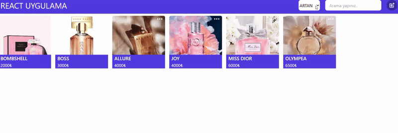

# 📦 Simple Product CRUD App (React)

Bu proje, React ile geliştirilmiş temel bir ürün yönetim uygulamasıdır. Kullanıcılar ürün ekleyebilir, listeleyebilir, güncelleyebilir ve silebilir. Uygulama, localStorage üzerinde çalışır, yani veriler tarayıcıda saklanır.

✨ Özellikler

📋 Ürün listeleme

➕ Yeni ürün ekleme (modal üzerinden)

📝 Mevcut ürünü güncelleme

❌ Ürün silme

💾 Veriler localStorage üzerinde tutulur

🔄 Modal tabanlı kullanıcı arayüzü

📎 Resim URL’si girerek ürün görseli ekleme

🌐 React Router ile URL üzerinden güncelleme desteği (query parametre)

# 🛠️ Kullanılan Teknolojiler

React

React Router DOM

React Icons

Tailwind CSS (ya da kendi stil dosyan, varsa belirt)

localStorage (veri yönetimi için)

# Ekran Görüntüsü

